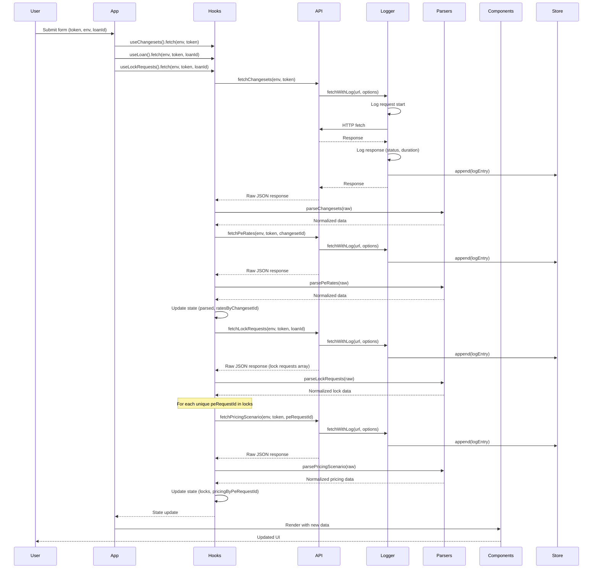

# Triage Tool

A React-based web application for triaging and analyzing Polly.io API data. This tool enables developers and support teams to quickly inspect changesets, loan data, and API call patterns across stage and production environments.

## Purpose

The Triage Tool provides a streamlined interface for:

- **Fetching and displaying recent changesets** with BaseRateSet information
- **Optionally fetching loan data** by LOS loan ID for detailed loan analysis
- **Fetching and displaying lock requests** for a loan with associated pricing scenarios
- **Monitoring API calls** through a built-in log panel with timing information
- **Switching between environments** (stage/production) for testing and debugging

This tool is particularly useful for:
- Debugging API issues
- Verifying changeset configurations
- Inspecting loan data structures
- Analyzing lock request history and pricing decisions
- Understanding API call patterns and performance
- Supporting customer inquiries with quick data access

## Technology Stack

- **React 19.2.0** - UI framework using functional components and hooks
- **Vite 7.2.4** - Build tool and development server
- **Tailwind CSS 3.4.19** - Utility-first CSS framework (configured but minimally used)
- **Lucide React** - Icon library for UI elements
- **ESLint 9.39.1** - Code linting with React hooks and refresh plugins
- **JSDoc** - Type annotations (no TypeScript)

## Architecture

The application follows a **layered architecture** pattern, separating concerns into distinct layers:


### Architecture Layers

1. **Presentation Layer** (`src/components/`)
   - React components for UI rendering
   - Inline styles (no CSS modules or styled-components)
   - Component composition pattern
   - Reusable primitives for consistent UI

2. **State Management Layer** (`src/hooks/`)
   - Custom hooks encapsulate data fetching and state
   - `useChangesets` - manages changeset data and PE rates
   - `useLoan` - manages loan data fetching with error handling
   - `useLockRequests` - manages lock requests and pricing scenario data
   - `useApiLog` - subscribes to API log store for real-time updates

3. **API Layer** (`src/api/`)
   - API client functions for external HTTP calls
   - `fetchWithLog` wrapper for automatic API call logging
   - Environment-aware base URL configuration
   - Structured error handling with preserved API error payloads

4. **Data Transformation Layer** (`src/parsers/`)
   - Normalizes raw API responses into consistent shapes
   - Type-safe parsing with fallbacks for missing data
   - Handles null/undefined values gracefully
   - Provides consistent data structures for components

5. **Global Store** (`src/api/apiLogStore.js`)
   - Singleton pattern for API log entries
   - Observer pattern for React subscriptions
   - In-memory storage (no persistence across page reloads)

## File Structure

```
src/
├── App.jsx                    # Main application component (orchestrates all sections)
├── main.jsx                   # React entry point with StrictMode
├── index.css                  # Tailwind CSS imports
│
├── components/
│   ├── Layout.jsx             # Page layout wrapper with max-width container
│   ├── TriageForm.jsx         # Input form (bearer token, environment, loan ID, checkbox)
│   ├── SectionContainer.jsx   # Collapsible section wrapper with chevron icons
│   ├── ChangesetSection.jsx   # Changeset list display with accordion
│   ├── LoanSection.jsx        # Loan details display (conditional rendering)
│   ├── LockRequestsSection.jsx # Lock requests display with accordion
│   ├── ErrorDisplay.jsx       # Error message component with formatted JSON
│   ├── ApiLogPanel.jsx        # Fixed bottom API log panel
│   ├── changesets/
│   │   └── ChangesetAccordionItem.jsx  # Individual changeset accordion item
│   └── details/
│       └── DetailPrimitives.jsx        # Reusable detail components (Grid, Section, Row)
│
├── hooks/
│   ├── useChangesets.js       # Changeset fetching hook with PE rates integration
│   ├── useLoan.js             # Loan fetching hook with error preservation
│   ├── useLockRequests.js     # Lock requests fetching hook with pricing scenarios
│   └── useApiLog.js           # API log subscription hook
│
├── api/
│   ├── config.js              # Environment base URLs (prod/stage)
│   ├── fetchWithLog.js        # Fetch wrapper with automatic logging
│   ├── apiLogStore.js         # Global API log store (singleton)
│   ├── changesets.js          # Changeset API client
│   ├── loans.js               # Loan API client
│   ├── lockRequests.js        # Lock requests API client
│   ├── peRates.js             # PE rates API client
│   └── pricingScenarios.js    # Pricing scenarios API client
│
└── parsers/
    ├── changesets.js          # Changeset response parser
    ├── loans.js               # Loan response parser
    ├── lockRequests.js        # Lock requests response parser
    ├── peRates.js             # PE rates response parser
    └── pricingScenarios.js    # Pricing scenarios response parser
```

## Data Flow



## Coding Standards

### Type Safety

The project uses **JSDoc annotations** instead of TypeScript for type documentation:

```javascript
/**
 * @param {'prod' | 'stage'} environment
 * @param {string} token
 * @returns {Promise<unknown>}
 */
export async function fetchChangesets(environment, token) {
  // ...
}
```

- Function parameters and return types are documented with JSDoc
- Type assertions use `/** @type {...} */` comments
- Complex types are documented inline

### Error Handling

Structured error objects are used consistently:

```javascript
// Error shape
{
  status?: number,
  statusText?: string,
  data?: unknown,
  message?: string
}
```

- API errors preserve the full error payload from responses
- Errors are thrown with structured objects, not Error instances
- Fallback error messages for unexpected runtime errors
- Error display components show formatted JSON for debugging

### Styling Conventions

**Inline styles are preferred** throughout the application:

```javascript
const inputStyle = {
  width: '100%',
  padding: '8px 12px',
  border: '1px solid #d1d5db',
  borderRadius: '6px',
  fontSize: '14px',
};
```

- No CSS modules or styled-components
- Tailwind CSS is configured but minimally used
- Style objects defined as constants in components
- Consistent color palette using Tailwind color values

### Component Patterns

- **Functional components only** - no class components
- **Hooks for state management** - useState, useCallback, useMemo, useEffect
- **Props destructuring** - destructure props in function parameters
- **Conditional rendering** - early returns for null states
- **Component composition** - reusable primitives (DetailGrid, DetailSection, DetailRow)

Example pattern:

```javascript
export default function LoanSection({ attempted, loan, error }) {
  // Early return pattern
  if (!attempted) return null;

  return (
    <SectionContainer title="Loan Snapshot">
      {error && <ErrorDisplay error={error} />}
      {!error && loan && <LoanDetails loan={loan} />}
    </SectionContainer>
  );
}
```

### ESLint Configuration

- React hooks rules enforced (`react-hooks/exhaustive-deps`)
- Unused variables allowed if prefixed with `[A-Z_]` (e.g., `_UNUSED`)
- Browser globals enabled
- React refresh plugin for Fast Refresh support

### API Patterns

All API calls follow consistent patterns:

```javascript
// 1. All calls go through fetchWithLog wrapper
const response = await fetchWithLog(url, {
  headers: {
    Accept: 'application/json',
    Authorization: `Bearer ${token}`,
    'Content-Type': 'application/json',
  },
});

// 2. Error handling preserves API error structure
if (!response.ok) {
  const errorData = await response.json().catch(() => ({ message: 'Unknown error' }));
  throw { status: response.status, statusText: response.statusText, data: errorData };
}

// 3. Return parsed JSON
return response.json();
```

- Bearer token authentication in headers
- Environment-aware base URLs via `getBaseUrl(environment)`
- Consistent error structure across all API functions
- Automatic logging of all API calls with timing

## API Endpoints

### Changesets API

**Endpoint**: `GET /api/v2/changesets/?pageSize=3`

- Fetches the 3 most recent changesets
- Returns paginated response with `total`, `changesets` array, `nextPage`, `previousPage`
- Requires Bearer token authentication

**Response Structure**:
```javascript
{
  total: number,
  changesets: Array<{
    id: string,
    name: string,
    details: {
      status: string,
      initiatedAt: string,
      publishedAt: string,
      pricingGeneratedAt: string
    },
    versionInfo: {
      basedOnId: string,
      additionsToBase: number,
      modificationsToBase: number,
      removalsFromBase: number
    }
  }>,
  nextPage: string | null,
  previousPage: string | null
}
```

### PE Rates API

**Endpoint**: `GET /api/v2/pe/rates/?changesetId={changesetId}`

- Fetches PE rates for a specific changeset
- Called for each changeset ID found in the changesets response
- Requires Bearer token authentication

**Response Structure**:
```javascript
{
  data: {
    items: Array<{
      id: string,
      changesetId: string,
      baseRateSetId?: string,
      createdOn?: string,
      isPublished?: boolean
    }>,
    total: number
  }
}
```

### Loans API

**Endpoint**: `GET /api/v2/loans/{losLoanId}/`

- Fetches loan data by LOS loan ID
- Only called if `hasLoanService` is checked and `losLoanId` is provided
- Requires Bearer token authentication

**Response Structure** (parsed):
```javascript
{
  loanNumber: string,
  losLoanId: string,
  purpose: string,
  amount: string,
  rate: string,
  productName: string,
  productCode: string,
  loanTerm: number | null,
  loanType: string,
  amortizationType: string,
  applicationDate: string,
  fundedAt: string,
  ltv: string,
  cltv: string,
  borrower: {
    firstName: string,
    lastName: string,
    fico: number | null,
    dtiRatio: string
  },
  property: {
    addressLine1: string,
    city: string,
    state: string,
    zipCode: string,
    propertyType: string,
    occupancy: string,
    appraisedValue: string
  },
  loanofficer: {
    name: string,
    email: string
  }
}
```

### Lock Requests API

**Endpoint**: `GET /api/v2/pe/loans/{losLoanId}/lock-requests/`

- Fetches all lock requests for a given loan
- Triggered automatically when `losLoanId` is provided (regardless of loan service checkbox)
- Requires Bearer token authentication
- Returns array of lock request objects

**Response Structure** (parsed):
```javascript
{
  items: Array<{
    id: number,
    requestedOn: string,
    requestedBy: string,
    requestedByUsername: string,
    isAutoTriggered: boolean,
    writeBackStatus: string,
    action: string,
    decision: string,
    approvalMode: string,
    buySide: {
      changesetId: string,
      channel: string,
      policyId: string,
      peRequestId: string,
      investor: string,
      investorId: number | null,
      rateSheetId: string,
      productName: string,
      productCode: string,
      rate: string,
      lockPeriod: number | null,
      expirationDate: string,
      lockConfirmedDate: string,
      basePrice: string,
      netPrice: string,
    },
    hasSellSide: boolean
  }>
}
```

### Pricing Scenarios API

**Endpoint**: `GET /api/v2/pe/pricing-scenarios/{peRequestId}/`

- Fetches detailed pricing scenario for a specific PE request
- Called automatically for each unique `peRequestId` found in lock requests
- Requires Bearer token authentication
- Large response object with borrower, loan, property, and search details

**Response Structure** (parsed summary):
```javascript
{
  baseRateSetId: string,
  changesetId: string,
  requestedOn: string,
  completedOn: string,
  borrower: {
    firstName: string,
    lastName: string,
    fico: number | null,
    dtiRatio: number | null,
    annualIncome: number | null,
  },
  loan: {
    amount: number | null,
    purpose: string,
    refinancePurpose: string,
    ltv: number | null,
    cltv: number | null,
    losLoanId: string,
  },
  property: {
    addressLine1: string,
    city: string,
    state: string,
    zipCode: string,
    propertyType: string,
    occupancy: string,
    appraisedValue: number | null,
  },
  search: {
    desiredLockPeriod: number | null,
    productCodes: string[],
    loanTypes: string[],
  }
}
```

## Environment Configuration

The application supports two environments:

- **Stage**: `https://api.stage.polly.io`
- **Production**: `https://api.prod.polly.io`

Environment selection is made via dropdown in the TriageForm component and passed to all API calls.

## Development Setup

### Prerequisites

- Node.js (version compatible with React 19.2.0)
- npm or yarn package manager

### Installation

```bash
# Install dependencies
npm install

# Start development server
npm run dev

# Build for production
npm run build

# Preview production build
npm run preview

# Run linter
npm run lint
```

### Development Server

The development server runs on `http://localhost:5173` (default Vite port) with Hot Module Replacement (HMR) enabled.

## Key Features

### Environment Switching

Users can toggle between stage and production environments via dropdown. All API calls use the selected environment's base URL.

### Conditional Loan Fetching

Loan data is only fetched when:
1. `hasLoanService` checkbox is checked
2. `losLoanId` input field has a value

This allows the tool to work without loan service access.

### API Logging

All API calls are automatically logged with:
- HTTP method
- URL (pathname + query string)
- Status code or error
- Duration in milliseconds
- Timestamp

The log panel can be toggled from a fixed button in the bottom-right corner.

### Error Display

Errors are displayed with:
- HTTP status code (if available)
- Full error payload formatted as JSON
- Red color scheme for visibility
- Preserved API error structure for debugging

### Lock Requests Analysis

- Automatically fetches all lock requests when a `losLoanId` is entered
- Displays each lock request in an accordion with:
  - Lock details (ID, requested date, requester, action, decision, approval mode)
  - Buy side information (product, rate, lock period, prices, investor)
  - Pricing scenario summary (borrower FICO/DTI, loan details, property info, search criteria)
- Fetches pricing scenarios for each unique `peRequestId` found in lock requests
- Resilient to individual pricing scenario fetch failures
- All accordions start closed after new analysis

### Collapsible Sections

- Changesets and Lock Requests sections use accordion pattern
- All accordions start closed after clicking Analyze (new analysis)
- Users manually expand items they want to inspect
- SectionContainer component provides consistent collapsible behavior
- Chevron icons indicate open/closed state

## Common Patterns

### Custom Hook Pattern

```javascript
export function useChangesets() {
  const [data, setData] = useState(null);
  const [parsed, setParsed] = useState(null);
  const [error, setError] = useState(null);
  const [loading, setLoading] = useState(false);

  const fetch = useCallback(async (environment, token) => {
    setLoading(true);
    setError(null);
    try {
      const raw = await fetchChangesets(environment, token);
      setData(raw);
      setParsed(parseChangesets(raw));
    } catch (err) {
      setError(err);
    } finally {
      setLoading(false);
    }
  }, []);

  return { data, parsed, error, loading, fetch };
}
```

### Lock Requests Hook Pattern

```javascript
export function useLockRequests() {
  const [locks, setLocks] = useState([]);
  const [pricingByPeRequestId, setPricingByPeRequestId] = useState({});
  const [error, setError] = useState(null);
  const [loading, setLoading] = useState(false);
  const [attempted, setAttempted] = useState(false);

  const fetch = useCallback(async (environment, token, loanId) => {
    setAttempted(true);
    setLoading(true);
    setError(null);
    setLocks([]);
    setPricingByPeRequestId({});

    try {
      const rawLocks = await fetchLockRequests(environment, token, loanId);
      const parsed = parseLockRequests(rawLocks);
      setLocks(parsed.items);

      // Collect unique peRequestIds for pricing lookups
      const peRequestIds = Array.from(
        new Set(
          parsed.items
            .map((lock) => lock.buySide?.peRequestId)
            .filter((id) => typeof id === 'string' && id.length > 0),
        ),
      );

      if (peRequestIds.length > 0) {
        const results = await Promise.all(
          peRequestIds.map(async (id) => {
            try {
              const rawPricing = await fetchPricingScenario(environment, token, id);
              const parsedPricing = parsePricingScenario(rawPricing);
              return [id, parsedPricing];
            } catch (err) {
              // Keep panel resilient even if some pricing calls fail
              return [id, null];
            }
          }),
        );

        const next = {};
        for (const [id, value] of results) {
          next[id] = value;
        }
        setPricingByPeRequestId(next);
      }
    } catch (err) {
      if (err && typeof err === 'object' && ('status' in err || 'data' in err)) {
        setError(err);
      } else {
        setError({ message: err?.message ?? String(err) });
      }
    } finally {
      setLoading(false);
    }
  }, []);

  const reset = useCallback(() => {
    setAttempted(false);
    setLocks([]);
    setPricingByPeRequestId({});
    setError(null);
    setLoading(false);
  }, []);

  return { locks, pricingByPeRequestId, error, loading, attempted, fetch, reset };
}
```

### Parser Pattern

```javascript
export function parseChangesets(rawResponse) {
  const fallback = { total: 0, changesets: [], nextPage: null, previousPage: null };
  
  if (!rawResponse || typeof rawResponse !== 'object') {
    return fallback;
  }
  
  // Type-safe extraction with fallbacks
  const raw = /** @type {...} */ (rawResponse);
  const list = Array.isArray(raw.changesets) ? raw.changesets : [];
  
  // Map and normalize
  const changesets = list.map((item) => {
    // ... normalization logic
  }).filter(Boolean);
  
  return { total, changesets, nextPage, previousPage };
}
```

### API Client Pattern

```javascript
export async function fetchChangesets(environment, token) {
  const baseUrl = getBaseUrl(environment);
  const url = `${baseUrl}/api/v2/changesets/?pageSize=3`;

  const response = await fetchWithLog(url, {
    headers: {
      Accept: 'application/json',
      Authorization: `Bearer ${token}`,
      'Content-Type': 'application/json',
    },
  });

  if (!response.ok) {
    const errorData = await response.json().catch(() => ({ message: 'Unknown error' }));
    throw { status: response.status, statusText: response.statusText, data: errorData };
  }

  return response.json();
}
```

## Best Practices

1. **Always use `fetchWithLog`** for API calls to ensure logging
2. **Preserve error structures** from API responses for debugging
3. **Use parsers** to normalize API responses before storing in state
4. **Early returns** in components for better readability
5. **JSDoc annotations** for all exported functions
6. **Inline styles** for component-specific styling
7. **Custom hooks** for reusable stateful logic
8. **Conditional rendering** based on data availability

## Notes for AI Assistants

When working with this codebase:

- **No TypeScript**: Use JSDoc for type information
- **Inline styles**: Don't create separate CSS files
- **Error objects**: Not Error instances, but plain objects with status/data
- **API logging**: Automatic via fetchWithLog wrapper
- **Environment config**: Centralized in `api/config.js`
- **Parser layer**: Always normalize API responses before use
- **Component patterns**: Functional components with hooks only
- **State management**: Custom hooks, no Redux or Context API
- **Styling**: Inline style objects, minimal Tailwind usage
- **Lock requests**: Fetched automatically when `losLoanId` is present, regardless of `hasLoanService` checkbox
- **Pricing scenarios**: Fetched per unique `peRequestId` found in lock requests, failures are isolated
- **Accordion state**: All accordions start closed after new analysis; users manually expand items

This structure enables quick understanding of the codebase and consistent patterns for extending functionality.
