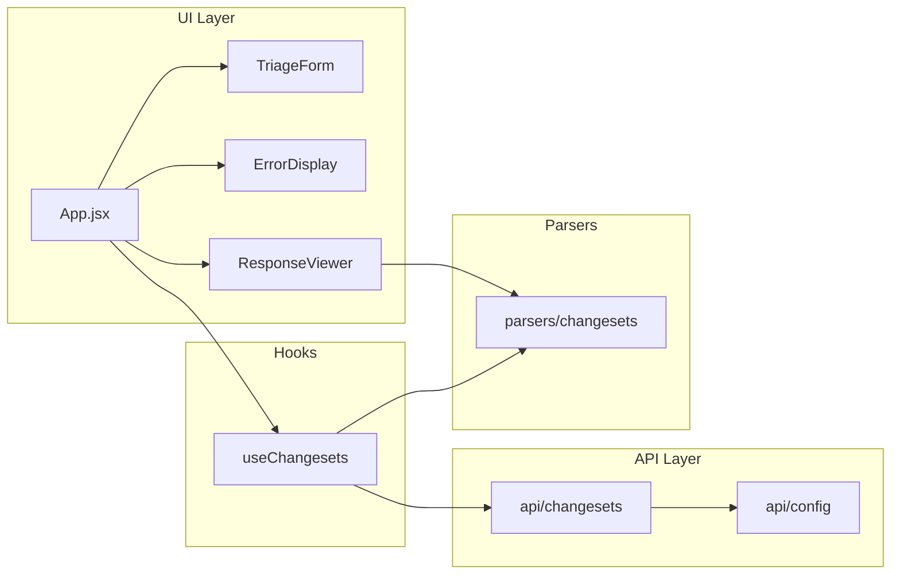

# Triage Tool – Scalable Folder Refactor

## Current state

- Single [src/App.jsx](src/App.jsx) contains: inline `fetchChangesets` API call, form state, and full UI (form, error block, raw JSON response).
- No parsing yet (raw JSON only); one API (Polly changesets).
- Entry: [src/main.jsx](src/main.jsx) → `App.jsx`. Global styles in [src/index.css](src/index.css); [src/App.css](src/App.css) is mostly unused boilerplate.

## Target structure

```
src/
├── api/                    # API layer – all HTTP / external calls
│   ├── config.js           # Base URLs, env constants
│   └── changesets.js       # fetchChangesets + changeset calls
├── parsers/                # Parsing & transform logic (for future use)
│   └── (e.g. changesets.js) # Transform raw API response → triage-friendly shape
├── components/             # UI – reusable pieces
│   ├── Layout.jsx          # Page shell (max-width, padding)
│   ├── TriageForm.jsx      # Token, environment, submit button
│   ├── ErrorDisplay.jsx    # Error state UI
│   └── ResponseViewer.jsx  # Success state (JSON or parsed view)
├── hooks/                  # Optional: keep App thin
│   └── useChangesets.js    # Encapsulates fetch + loading/error/response state
├── App.jsx                 # Thin: compose hooks + components
├── main.jsx
├── index.css
└── assets/
```

- **api/** – Every external call lives here. One module per “service” or endpoint family (e.g. `changesets.js`). Add more files as you add APIs (e.g. `users.js`, `webhooks.js`). Config (base URLs, env) in `config.js` so all API modules share it.
- **parsers/** – All logic that turns raw API JSON into shapes your UI or triage flow needs. Start with a single parser (e.g. for changesets) or empty; add more as you add “heavy parsing.”
- **components/** – All presentational UI. Form, error display, and response viewer become separate components so you can later add a “robust UI” (tables, filters, tabs) without touching API or parsing code.
- **hooks/** – Optional but recommended: a small hook (e.g. `useChangesets`) that calls the API, manages loading/error/response state, and returns `{ data, error, loading, fetch }`. App then only composes the hook and components.

## Data flow (after refactor)




- **App** wires hook + Layout + Form + ErrorDisplay + ResponseViewer.
- **useChangesets** (or equivalent) calls `api/changesets`, then optionally runs a parser; returns `{ data, error, loading, refetch }`.
- **Parsers** are pure functions: raw API response → triage-friendly structure; can be used inside the hook or in the viewer.

## Migration steps

1. **Add `src/api/config.js**`
  Export base URLs (e.g. `getBaseUrl(environment)`) using current prod/stage URLs from App.
2. **Add `src/api/changesets.js**`
  Move `fetchChangesets(environment, token)` here; use config for base URL. Export `fetchChangesets`. Keep the same fetch + error handling (response.ok, throw with status/data).
3. **Add `src/parsers/**`
  Add a placeholder or minimal parser (e.g. `parsers/changesets.js` that for now returns the raw payload or a simple normalized shape). This establishes the convention; you can expand later.
4. **Add `src/hooks/useChangesets.js**`
  Hook that: takes `environment` and `token` (or receives them when calling `fetch()`); calls `api/changesets.fetchChangesets`; manages `loading`, `error`, `response`; optionally runs the parser and exposes parsed result. Returns `{ data, error, loading, fetch }` (or equivalent).
5. **Add UI components under `src/components/**`
  - **Layout.jsx** – Wrapper with current layout styles (min-height, background, max-width, padding).  
  - **TriageForm.jsx** – Controlled inputs for bearer token and environment, submit button, `onSubmit` prop. No API calls; receives `loading` and `disabled` from parent.  
  - **ErrorDisplay.jsx** – Accepts `error` (object with status/data); renders the current error box and `JSON.stringify(error, null, 2)`.  
  - **ResponseViewer.jsx** – Accepts `response` (and optionally `parsed`). For now render raw JSON; later you can switch to parsed view or tabs (raw vs parsed).
6. **Refactor `App.jsx**`
  - Use `useChangesets` (or pass token/env into a `fetch` from the hook).  
  - Render: `Layout` → `TriageForm` (onSubmit triggers fetch) + `ErrorDisplay` (when error) + `ResponseViewer` (when response).  
  - Remove all inline API and UI implementation details from App.
7. **Cleanup**
  - Update [src/main.jsx](src/main.jsx) if any import paths change (they should still be `./App.jsx`).  
  - Remove or trim [src/App.css](src/App.css) if unused; keep [src/index.css](src/index.css) for Tailwind and global styles.

## Scaling later

- **More API calls** – New files in `api/` (e.g. `api/users.js`, `api/webhooks.js`) and new hooks in `hooks/` if needed.  
- **Heavy parsing** – New or expanded modules in `parsers/`; call from hooks or from components.  
- **Robust UI** – New components (tables, filters, tabs, modals) in `components/`; App or a higher-level “page” component composes them. Shared styles can live next to components or in a small `styles/` folder if you outgrow Tailwind-only.

## File checklist


| Action           | Path                                         |
| ---------------- | -------------------------------------------- |
| Create           | `src/api/config.js`                          |
| Create           | `src/api/changesets.js`                      |
| Create           | `src/parsers/changesets.js` (or placeholder) |
| Create           | `src/hooks/useChangesets.js`                 |
| Create           | `src/components/Layout.jsx`                  |
| Create           | `src/components/TriageForm.jsx`              |
| Create           | `src/components/ErrorDisplay.jsx`            |
| Create           | `src/components/ResponseViewer.jsx`          |
| Refactor         | `src/App.jsx`                                |
| Optional cleanup | `src/App.css`                                |


No changes to `main.jsx`, `index.html`, or Vite config are required for this refactor; only `App.jsx` and new files under `src/`.